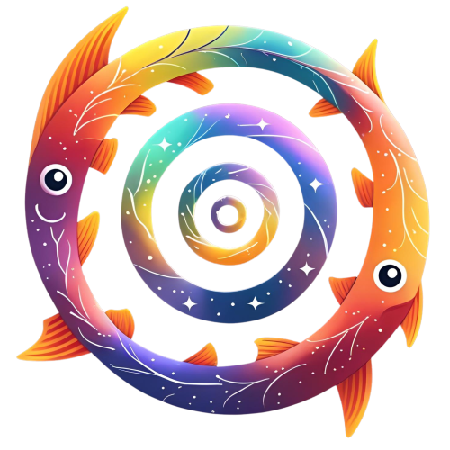

Pisces
=========

|YT-PROJECT| |RUFF| |PRE-COMMIT| |NUMPYDOC| |COMMITIZEN| |CONVENTIONAL-COMMITS| |LAST-COMMIT| |CONTRIBUTORS| |DOCS|

.. raw:: html

   

**Pisces (or Py-ICs)** is an open-source toolkit for constructing models of astrophysical systems and generating data for
simulations. Designed for flexibility and ease of use, Pisces enables researchers to create a wide range of astrophysical
models—including galaxies, galaxy clusters, and early universe perturbations—whether for direct analysis or as input for
simulation software.

Rather than being limited to initial condition generation, Pisces provides a modular and extensible framework that
supports a variety of scientific use cases. It is built to integrate seamlessly with major astrophysical simulation
tools through dedicated frontends, ensuring broad compatibility and interoperability.

The core package is structured to facilitate customization and development, allowing users to adapt it to their specific
research needs. All essential tools for model construction are included, with an emphasis on accessibility and ease of extension.

Development takes place on `GitHub <https://www.github.com/eliza-diggins/Pisces>`_. If you encounter any issues, documentation
gaps, or have feature suggestions, we encourage you to submit them via the repository's issues page.

.. raw:: html

   

Installation
============
Pisces is written in Python 3.8 and is compatible with Python 3.8+ with continued support for older versions of Python. For instructions
on installation and getting started, check out the :ref:`getting_started` page.

Resources
=========

.. grid:: 2
    :padding: 3
    :gutter: 5

    .. grid-item-card::
        :img-top: images/index/stopwatch_icon.png

        Quickstart Guide
        ^^^^^^^^^^^^^^^^
        New to ``Pisces``? The quickstart guide is the best place to start learning to use all of the
        tools that we have to offer!

        +++

        .. button-ref:: getting_started
            :expand:
            :color: secondary
            :click-parent:

            To The Quickstart Page

    .. grid-item-card::
        :img-top: images/index/lightbulb.png

        Examples
        ^^^^^^^^
        Have some basic experience with ``Pisces`` but want to see a guide on how to execute a particular task? Need
        to find some code to copy and paste? The examples page contains a wide variety of use case examples and explanations
        for all of the various parts of the ``Pisces`` library.

        +++

        .. button-ref:: auto_examples/index
            :expand:
            :color: secondary
            :click-parent:

            To the Examples Page

    .. grid-item-card::
        :img-top: images/index/book.png

        User References
        ^^^^^^^^^^^^^^^^
        The user guide contains comprehensive, text-based explanations of the backbone components of the ``Pisces`` library.
        If you're looking for information on the underlying code or for more details on particular aspects of the API, this is your best resource.

        +++

        .. button-ref:: reference/user_guide
            :expand:
            :color: secondary
            :click-parent:

            To the User Guide

    .. grid-item-card::
        :img-top: images/index/api_icon.png

        API Reference
        ^^^^^^^^^^^^^

        Doing a deep dive into our code? Looking to contribute to development? The API reference is a comprehensive resource
        complete with source code and type hinting so that you can find every detail you might need.

        +++

        .. button-ref:: api
            :expand:
            :color: secondary
            :click-parent:

            API Reference

Contents
========
.. raw:: html

   

.. toctree::
   :maxdepth: 1

   api
   reference/user_guide
   auto_examples/index
   getting_started

Indices and tables
==================

.. raw:: html

   

* :ref:`genindex`
* :ref:`modindex`
* :ref:`search`

.. |yt-project| image:: https://img.shields.io/static/v1?label=yt&message=compatible&color=blueviolet
   :target: https://yt-project.org
   :alt: Works with yt

.. |docs| image:: https://img.shields.io/badge/docs-latest-brightgreen.svg
   :target: https://eliza-diggins.github.io/Pisces
   :alt: Latest Docs

.. |ruff| image:: https://img.shields.io/endpoint?url=https://raw.githubusercontent.com/astral-sh/ruff/main/assets/badge/v2.json
    :target: https://github.com/astral-sh/ruff
    :alt: Ruff

.. |pre-commit| image:: https://img.shields.io/badge/pre--commit-enabled-brightgreen?logo=pre-commit
   :target: https://github.com/pre-commit/pre-commit
   :alt: pre-commit

.. |numpydoc| image:: https://img.shields.io/badge/docstyle-numpydoc-459db9
   :target: https://numpydoc.readthedocs.io/en/latest/
   :alt: Docstring style: numpydoc

.. |commitizen| image:: https://img.shields.io/badge/commitizen-friendly-brightgreen.svg
   :target: https://commitizen-tools.github.io/commitizen/
   :alt: Commit style: Conventional + Gitmoji

.. |conventional-commits| image:: https://img.shields.io/badge/Conventional%20Commits-1.0.0-%23FE5196?logo=conventionalcommits&logoColor=white
   :target: https://www.conventionalcommits.org/en/v1.0.0/
   :alt: Commit style: Conventional Commits

.. |contributors| image:: https://img.shields.io/github/contributors/eliza-diggins/Pisces
   :target: https://github.com/eliza-diggins/Pisces/graphs/contributors
   :alt: GitHub Contributors

.. |last-commit| image:: https://img.shields.io/github/last-commit/eliza-diggins/Pisces
   :target: https://github.com/eliza-diggins/Pisces
   :alt: Last Commit
